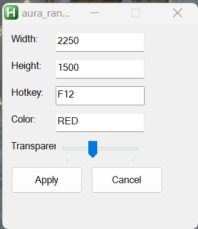

# PathOfExileAuraBotMacro

Are you a stressed out AuraBot trying to keep one or more idiots inside your protective aura range? Well look no further the POE aura bot macro makes it easy for you to see who is & is not inside your aura range.

# How Does It Work?

It's pretty simple, you press a button and you get a transparent circle on your screen.

You'll need to do some initial configuration to make sure the circle is setup correctly for your personal aura range capabilities (have someone stand on the edge of your aura range, make adjustments, etc).

# Settings

And we even have some settings. The Width & Height are the most important settings, as you'll need to adjust these to match your aura range.

Other than that you can change the hotkey that toggles the circle on & off, change the color of the circle, and change the level of transparency the circle has.
